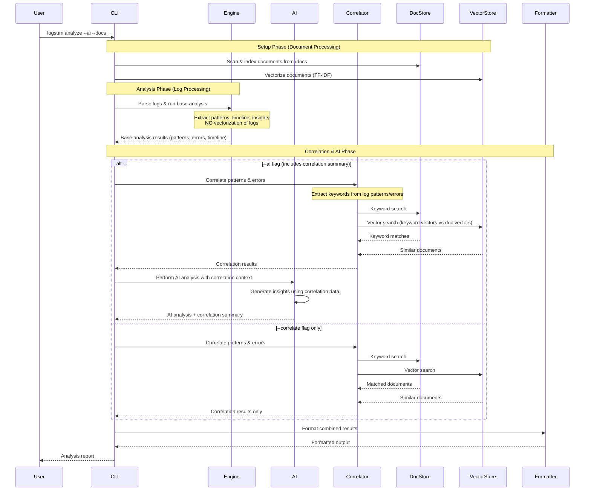
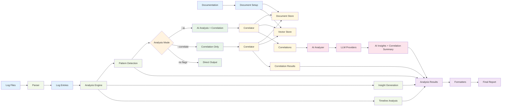
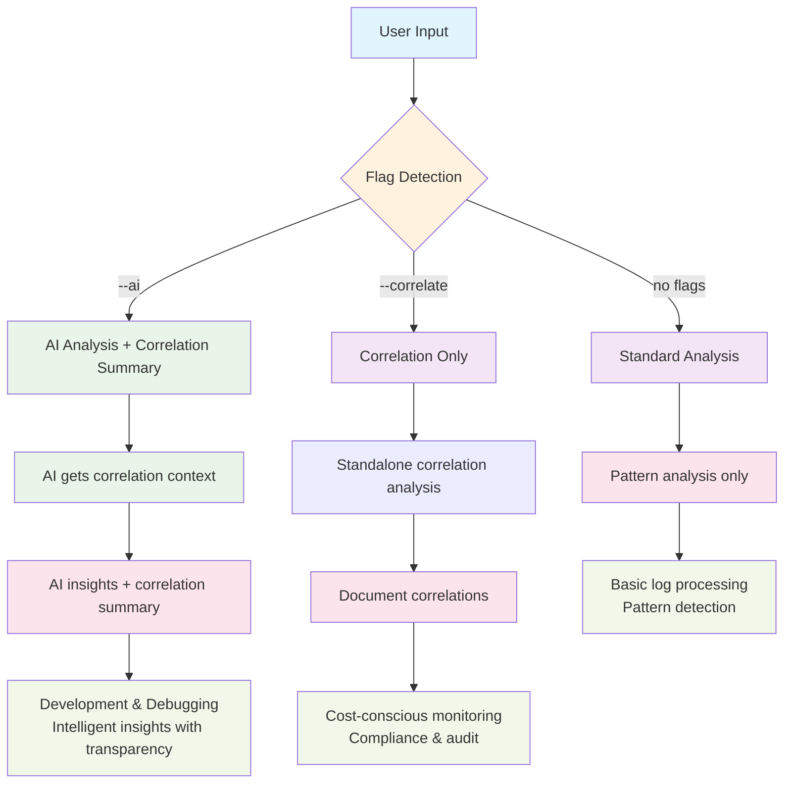
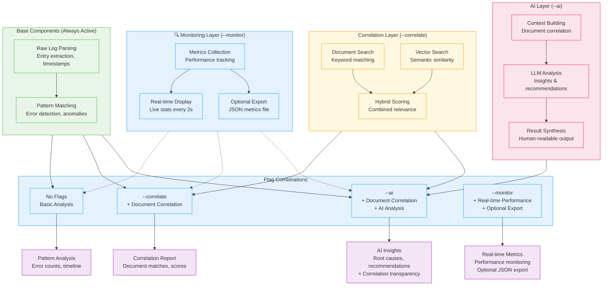

# LogSum Architecture Diagram

## Overall System Architecture

```mermaid
graph TB
    %% CLI Layer
    CLI[CLI Interface<br/>internal/cli/]
    CLI --> |analyze command| ANALYZE[Analyze Handler<br/>analyze.go]
    CLI --> |monitor command| MONITOR[Monitor Handler<br/>monitor.go]
    CLI --> |watch command| WATCH[Watch Handler<br/>watch.go]

    %% Analysis Decision Logic
    ANALYZE --> DECISION{Flag Detection}
    DECISION --> |--ai (with/without --correlate)| AIONLY[AI Analysis + Correlation Summary<br/>performAIAnalysis()]
    DECISION --> |--correlate only| CORRONLY[Standard + Correlation<br/>runCLIAnalysis()]
    DECISION --> |no flags| STANDARD[Standard Analysis<br/>engine.Analyze()]
    
    %% Monitoring Integration (Optional)
    ANALYZE --> |--monitor flag| MONITOR_SETUP[Setup Monitoring<br/>setupMonitoring()]
    MONITOR_SETUP --> COLLECTOR[Metrics Collector<br/>internal/monitor/]
    COLLECTOR --> REALTIME[Real-time Display<br/>showRealTimeMetrics()]

    %% Core Analysis Pipeline
    AIONLY --> ENGINE[Analyzer Engine<br/>internal/analyzer/]
    AIONLY --> CORR[Correlator<br/>internal/correlation/]
    AIONLY --> AI[AI Analyzer<br/>AnalyzeWithAI()]
    CORR --> AI
    
    CORRONLY --> ENGINE
    CORRONLY --> CORR2[Correlator<br/>internal/correlation/]
    
    STANDARD --> ENGINE
    
    %% Monitoring Instrumentation (when --monitor enabled)
    COLLECTOR -.-> |Wraps Operations| ENGINE
    COLLECTOR -.-> |Tracks Performance| CORR
    COLLECTOR -.-> |Monitors AI Calls| AI
    REALTIME -.-> |Updates Every 2s| COLLECTOR

    %% Analysis Engine Components
    ENGINE --> PATTERN[Pattern Matcher<br/>engine.go]
    ENGINE --> INSIGHT[Insight Generator<br/>engine.go]
    ENGINE --> TIMELINE[Timeline Generator<br/>engine.go]

    %% AI Analysis Components
    AI --> |AI Providers| OLLAMA[Ollama Provider<br/>internal/ai/providers/ollama/]
    AI --> |AI Providers| OPENAI[OpenAI Provider<br/>internal/ai/providers/openai/]
    AI --> |Prompt Building| PROMPT[go-promptfmt<br/>External Library]

    %% Correlation System
    CORR --> |Document Search| DOCSTORE[Document Store<br/>internal/docstore/]
    CORR --> |Semantic Search| VECTOR[Vector Store<br/>internal/vectorstore/]
    CORR --> |Keyword Extraction| EXTRACT[Keyword Extractor<br/>extractor.go]
    CORR2 --> DOCSTORE
    CORR2 --> VECTOR
    CORR2 --> EXTRACT

    %% Document Store Components
    DOCSTORE --> MEMORY[Memory Store<br/>memory.go]
    DOCSTORE --> SCANNER[Document Scanner<br/>scanner.go]
    DOCSTORE --> INDEXER[Indexer<br/>indexer.go]

    %% Vector Store Components
    VECTOR --> TFIDF[TF-IDF Vectorizer<br/>vectorizer.go]
    VECTOR --> SIMILARITY[Similarity Calculator<br/>similarity.go]
    VECTOR --> CACHE[Vector Cache<br/>memory.go]

    %% Output Convergence
    AIONLY --> FORMAT[Formatters<br/>internal/formatter/]
    CORRONLY --> FORMAT
    STANDARD --> FORMAT

    %% Output Formatters
    FORMAT --> MARKDOWN[Markdown Formatter<br/>markdown.go]
    FORMAT --> JSON[JSON Formatter<br/>json.go]
    FORMAT --> TEXT[Text Formatter<br/>text.go]
    FORMAT --> CSV[CSV Formatter<br/>csv.go]

    %% Configuration & Utilities
    CONFIG[Config System<br/>internal/config/]
    LOGGER[Logging System<br/>internal/logger/]
    COMMON[Common Types<br/>internal/common/]
    MONITOR_SYS[Monitor System<br/>internal/monitor/]

    %% Data Flow
    CLI -.-> CONFIG
    ENGINE -.-> LOGGER
    AI -.-> LOGGER
    CORR -.-> LOGGER
    ENGINE -.-> COMMON
    AI -.-> COMMON
    CORR -.-> COMMON
    
    %% Monitoring Integration
    COLLECTOR -.-> MONITOR_SYS
    REALTIME -.-> MONITOR_SYS

    %% External Dependencies
    EXT1[External: go-logparser]
    EXT2[External: go-promptfmt] 
    EXT3[External: Cobra CLI]
    EXT4[External: Bubble Tea UI]

    CLI -.-> EXT3
    ANALYZE -.-> EXT4
    ENGINE -.-> EXT1
    AI -.-> EXT2

    %% Styling
    classDef cliLayer fill:#e1f5fe
    classDef decisionLayer fill:#fff3e0
    classDef pipelineLayer fill:#e8f5e8
    classDef analysisLayer fill:#f3e5f5
    classDef correlationLayer fill:#fff8e1
    classDef storageLayer fill:#fce4ec
    classDef outputLayer fill:#f1f8e9
    classDef monitorLayer fill:#e8f8f5

    class CLI,ANALYZE,MONITOR,WATCH cliLayer
    class DECISION decisionLayer
    class AIONLY,CORRONLY,STANDARD pipelineLayer
    class ENGINE,AI,AI2,PATTERN,INSIGHT,TIMELINE,OLLAMA,OPENAI,PROMPT analysisLayer
    class CORR,CORR2,EXTRACT correlationLayer
    class DOCSTORE,VECTOR,MEMORY,SCANNER,INDEXER,TFIDF,SIMILARITY,CACHE storageLayer
    class FORMAT,MARKDOWN,JSON,TEXT,CSV outputLayer
    class MONITOR_SETUP,COLLECTOR,REALTIME,MONITOR_SYS monitorLayer
```

## Data Flow Architecture



## Component Interaction Map



## Package Dependency Graph

```mermaid
graph TD
    %% Main Entry Point
    MAIN[cmd/logsum/main.go]
    MAIN --> CLI[internal/cli/]

    %% CLI Dependencies
    CLI --> CONFIG[internal/config/]
    CLI --> ANALYZER[internal/analyzer/]
    CLI --> CORRELATION[internal/correlation/]
    CLI --> FORMATTER[internal/formatter/]
    CLI --> LOGGER[internal/logger/]
    CLI --> COMMON[internal/common/]
    CLI --> UI[internal/ui/]
    CLI --> MONITOR[internal/monitor/]

    %% Analyzer Dependencies
    ANALYZER --> AI[internal/ai/]
    ANALYZER --> COMMON
    ANALYZER --> LOGGER

    %% AI Dependencies
    AI --> PROVIDERS[internal/ai/providers/]
    AI --> COMMON
    PROVIDERS --> OLLAMA[ollama/]
    PROVIDERS --> OPENAI[openai/]

    %% Correlation Dependencies
    CORRELATION --> DOCSTORE[internal/docstore/]
    CORRELATION --> VECTORSTORE[internal/vectorstore/]
    CORRELATION --> LOGGER
    CORRELATION --> COMMON

    %% Document Store Dependencies
    DOCSTORE --> COMMON

    %% Vector Store Dependencies
    VECTORSTORE --> COMMON

    %% Formatter Dependencies
    FORMATTER --> COMMON

    %% UI Dependencies
    UI --> COMMON

    %% Monitor Dependencies
    MONITOR --> ANALYZER
    MONITOR --> COMMON

    %% Logger Dependencies (standalone)
    LOGGER --> [No internal dependencies]

    %% External Dependencies
    EXT_COBRA[External: github.com/spf13/cobra]
    EXT_BUBBLETEA[External: github.com/charmbracelet/bubbletea]
    EXT_LOGPARSER[External: go-logparser]
    EXT_PROMPTFMT[External: go-promptfmt]
    EXT_FSNOTIFY[External: github.com/fsnotify/fsnotify]

    CLI -.-> EXT_COBRA
    CLI -.-> EXT_FSNOTIFY
    UI -.-> EXT_BUBBLETEA
    ANALYZER -.-> EXT_LOGPARSER
    AI -.-> EXT_PROMPTFMT

    %% Styling
    classDef main fill:#ffebee
    classDef internal fill:#e8f5e8
    classDef utility fill:#fff3e0
    classDef external fill:#e1f5fe

    class MAIN main
    class CLI,CONFIG,ANALYZER,CORRELATION,FORMATTER,COMMON,AI,PROVIDERS,OLLAMA,OPENAI,DOCSTORE,VECTORSTORE,UI,MONITOR internal
    class LOGGER utility
    class EXT_COBRA,EXT_BUBBLETEA,EXT_LOGPARSER,EXT_PROMPTFMT,EXT_FSNOTIFY external
```

## Command Usage Patterns



## Component Hierarchy by Flag

